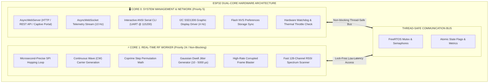
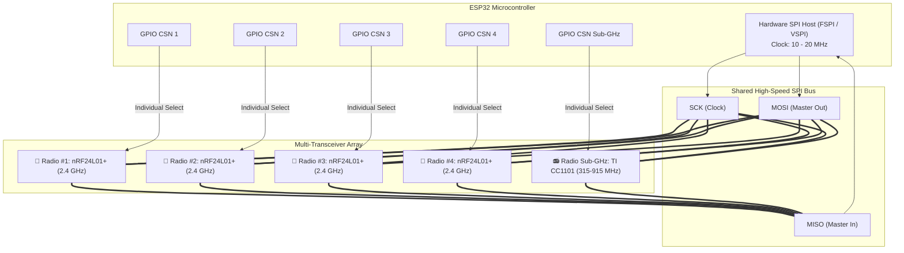
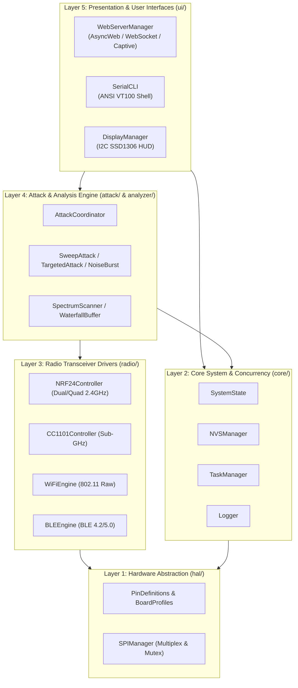

# ESP32-RF-SWORD: System Architecture & Design

## 1. Executive Summary

ESP32-RF-SWORD is a modular, multi-radio RF transmission and spectrum research platform built on the ESP32 microcontroller family. It expands significantly upon basic 2.4 GHz sweep concepts by introducing multi-core FreeRTOS concurrency, multi-transceiver SPI multiplexing (Dual/Quad nRF24L01+ and Sub-GHz CC1101), native ESP32 802.11/BLE packet injection engines, an embedded real-time Web dashboard, and an ANSI interactive serial CLI.

---

## 2. Multi-Core Task Scheduling & Concurrency

### FreeRTOS Core Separation Benefits:
- **Zero RF Jitter**: The radio frequency hopping loop runs uninterrupted on Core 1 at priority 24 without being blocked by Wi-Fi TCP network handshakes, WebSocket serialization, or OLED I2C transactions.
- **Thread Safety**: Inter-core communication is managed via atomic variables, mutex locks (`SPIManager`, `Logger`, `SystemState`), and FreeRTOS semaphores.

---

## 3. High-Speed SPI Bus Multiplexing & CSN Conditioning

### Bus Conditioning Mechanism:
1. **Pre-Conditioning Phase**: Before initializing any transceiver, the firmware asserts all Chip Select Not (`CSN`) lines `HIGH` and all Chip Enable (`CE`) lines `LOW`. This forces all unselected radio transceivers into high-impedance (High-Z) mode on `MISO`, preventing SPI bus contention.
2. **Double Initialization**: A 500 ms power-rail settling delay is inserted between initial SPI initialization and configuration register writes, ensuring high-power PA/LNA front-ends are stable.
3. **Dynamic Clock Scaling**: The SPI bus defaults to 16 MHz with automatic support for 20 MHz experimental turbo mode or 10 MHz safe fallback.

---

## 4. Mathematical RF Hopping Algorithms

### Coprime Permutation Hop:
To cover an arbitrary span of $N$ RF channels uniformly without repeating until all channels are visited, the firmware calculates an optimal step $S$ such that:
$$\gcd(S, N) = 1$$

The recurrence relation for Radio 0 is:
$$\text{Channel}_0(k) = \text{minChannel} + (k \cdot S) \pmod N$$

For a multi-radio array of $M$ transceivers, each subsequent radio is offset by an orthogonal stride $\Delta = \lfloor N / M \rfloor$:
$$\text{Channel}_m(k) = \text{minChannel} + ((k \cdot S) + m \cdot \Delta) \pmod N$$

This mathematical guarantee ensures that no two radios ever transmit on the same channel simultaneously during the entire cycle.

### Gaussian Dwell Jitter:
To defeat spectrum counter analyzers and adaptive receiver notch filters, the dwell duration $t_{\text{dwell}}$ on each channel is varied pseudo-randomly:
$$t_{\text{dwell}} \sim \mathcal{U}(t_{\min}, t_{\max})$$
where $t_{\min} = 120\,\mu\text{s}$ and $t_{\max} = 180\,\mu\text{s}$ by default.

---

## 5. Software Layers

1. **Hardware Abstraction Layer (`hal/`)**: Board profile auto-detection (`ESP32-C3`, `ESP32-S3`, `ESP32 DevKit`, `ESP32-C6`), GPIO pin mappings, SPI bus arbitration.
2. **Radio Engine Layer (`radio/`)**: Low-level register drivers for nRF24L01+, TI CC1101, native ESP32 Wi-Fi raw frame engine, and native BLE advertising engine.
3. **Attack & Research Layer (`attack/`)**: High-level attack coordinators, sweepers, protocol jammers, noise generators, and targeted frequency profiles.
4. **Spectrum Analysis Layer (`analyzer/`)**: Fast 128-channel RSSI scanner and circular waterfall buffer.
5. **User Interface Layer (`ui/`)**: Async Web server, WebSocket telemetry broadcaster, ANSI VT100 interactive Serial CLI, and I2C SSD1306 graphic display driver.
6. **Core System Layer (`core/`)**: Atomic runtime state, NVS flash persistence, FreeRTOS task coordinator, and thread-safe color logger.
