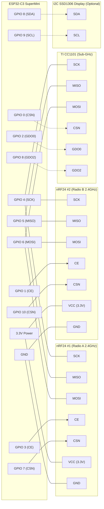
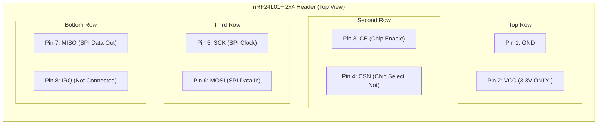

# Hardware Wiring & Pinout Guide

This document contains complete wiring schematics, Mermaid hardware interconnection diagrams, and GPIO pinout mappings for all supported ESP32 boards.

---

## Power Supply & Decoupling Capacitor Notice (CRITICAL)

> [!IMPORTANT]
> **nRF24L01+ and CC1101 PA/LNA Modules require stable 3.3V power.**
> High-power PA+LNA modules draw current spikes up to 150–250 mA during RF transmission bursts.
> 1. Solder a **10 µF to 100 µF electrolytic or tantalum capacitor** (plus a 0.1 µF ceramic capacitor) directly across the `VCC` (3.3V) and `GND` pins on the bottom of each radio module.
> 2. **NEVER connect nRF24 or CC1101 to 5V power rails.** 5V will permanently destroy the radio transceivers. (However, their SPI digital input pins are 5V-tolerant).

---

## Profile 1: ESP32-C3 SuperMini (Headless / Ultra-Compact)

The ESP32-C3 SuperMini is an ultra-small single-core RISC-V board ideal for building pocket-sized 2.4 GHz multi-radio devices.

### Wiring Table (ESP32-C3 SuperMini):
| Component | Signal | ESP32-C3 GPIO | Description |
|---|---|---|---|
| **SPI Bus** | SCK | `GPIO 4` | Shared SPI Clock |
| | MISO | `GPIO 5` | Shared SPI Master-In-Slave-Out |
| | MOSI | `GPIO 6` | Shared SPI Master-Out-Slave-In |
| | VCC | `3.3V` | 3.3V Power (with capacitor) |
| | GND | `GND` | Common Ground |
| **nRF24 #1 (Radio A)** | CE | `GPIO 3` | Radio A Chip Enable |
| | CSN | `GPIO 7` | Radio A Chip Select |
| **nRF24 #2 (Radio B)** | CE | `GPIO 1` | Radio B Chip Enable |
| | CSN | `GPIO 10`| Radio B Chip Select |
| **CC1101 (Optional)** | CSN | `GPIO 0` | Sub-GHz Chip Select |
| | GDO0 | `GPIO 2` | Sub-GHz GDO0 |
| | GDO2 | `GPIO 8` | Sub-GHz GDO2 |
| **I2C OLED (Optional)**| SDA | `GPIO 8` | I2C Data |
| | SCL | `GPIO 9` | I2C Clock |

---

## Profile 2: ESP32 DevKit V1 / WROOM-32 (Standard Dual-Core)

```mermaid
flowchart TD
    subgraph ESP32_DEVKIT ["ESP32 DevKit V1 (30 / 38 Pin)"]
        VSPI_SCK["GPIO 18 (VSPI SCK)"]
        VSPI_MISO["GPIO 19 (VSPI MISO)"]
        VSPI_MOSI["GPIO 23 (VSPI MOSI)"]
        
        CSN_A["GPIO 5 (CSN 1)"]
        CE_A["GPIO 4 (CE 1)"]
        
        CSN_B["GPIO 15 (CSN 2)"]
        CE_B["GPIO 2 (CE 2)"]
        
        CSN_C["GPIO 12 (CSN 3)"]
        CE_C["GPIO 13 (CE 3)"]
        
        CSN_D["GPIO 27 (CSN 4)"]
        CE_D["GPIO 14 (CE 4)"]
        
        CSN_CC["GPIO 26 (CC1101 CSN)"]
        GDO0_CC["GPIO 25 (GDO0)"]
        GDO2_CC["GPIO 33 (GDO2)"]
        
        I2C_SDA["GPIO 21 (SDA)"]
        I2C_SCL["GPIO 22 (SCL)"]
    end

    subgraph ARRAY_24G ["2.4GHz nRF24L01+ Quad Array"]
        MOD_A["Radio #1 (A)"]
        MOD_B["Radio #2 (B)"]
        MOD_C["Radio #3 (C)"]
        MOD_D["Radio #4 (D)"]
    end

    subgraph SUB_MOD ["Sub-GHz Transceiver"]
        MOD_CC["TI CC1101 Module"]
    end

    subgraph OLED_MOD ["I2C OLED Screen"]
        MOD_OLED["0.96 inch SSD1306 (0x3C)"]
    end

    VSPI_SCK --- MOD_A
    VSPI_SCK --- MOD_B
    VSPI_SCK --- MOD_C
    VSPI_SCK --- MOD_D
    VSPI_SCK --- MOD_CC

    VSPI_MISO --- MOD_A
    VSPI_MISO --- MOD_B
    VSPI_MISO --- MOD_C
    VSPI_MISO --- MOD_D
    VSPI_MISO --- MOD_CC

    VSPI_MOSI --- MOD_A
    VSPI_MOSI --- MOD_B
    VSPI_MOSI --- MOD_C
    VSPI_MOSI --- MOD_D
    VSPI_MOSI --- MOD_CC

    CSN_A --> MOD_A
    CE_A --> MOD_A
    CSN_B --> MOD_B
    CE_B --> MOD_B
    CSN_C --> MOD_C
    CE_C --> MOD_C
    CSN_D --> MOD_D
    CE_D --> MOD_D

    CSN_CC --> MOD_CC
    GDO0_CC --> MOD_CC
    GDO2_CC --> MOD_CC

    I2C_SDA --> MOD_OLED
    I2C_SCL --> MOD_OLED
```

### Wiring Table (ESP32 DevKit V1):
| Component | Signal | ESP32 GPIO | Notes |
|---|---|---|---|
| **Shared SPI Bus** | SCK | `GPIO 18` | Hardware VSPI SCK |
| | MISO | `GPIO 19` | Hardware VSPI MISO |
| | MOSI | `GPIO 23` | Hardware VSPI MOSI |
| **nRF24 #1 (A)** | CE | `GPIO 4` | Radio A Chip Enable |
| | CSN | `GPIO 5` | Radio A Chip Select |
| **nRF24 #2 (B)** | CE | `GPIO 2` | Radio B Chip Enable |
| | CSN | `GPIO 15`| Radio B Chip Select |
| **nRF24 #3 (C)** | CE | `GPIO 13`| Radio C Chip Enable |
| | CSN | `GPIO 12`| Radio C Chip Select |
| **nRF24 #4 (D)** | CE | `GPIO 14`| Radio D Chip Enable |
| | CSN | `GPIO 27`| Radio D Chip Select |
| **CC1101 Sub-GHz** | CSN | `GPIO 26`| CC1101 Chip Select |
| | GDO0 | `GPIO 25`| CC1101 Digital IO 0 |
| | GDO2 | `GPIO 33`| CC1101 Digital IO 2 |
| **I2C SSD1306 OLED** | SDA | `GPIO 21`| Hardware I2C SDA |
| | SCL | `GPIO 22`| Hardware I2C SCL |

---

## Profile 3: ESP32-S3 DevKit (Dual-Core LX7)

### Wiring Table (ESP32-S3):
| Component | Signal | ESP32-S3 GPIO | Description |
|---|---|---|---|
| **Shared SPI Bus** | SCK | `GPIO 12` | Hardware FSPI Clock |
| | MISO | `GPIO 13` | Hardware FSPI MISO |
| | MOSI | `GPIO 11` | Hardware FSPI MOSI |
| **nRF24 #1 (A)** | CE / CSN | `GPIO 10` / `GPIO 9` | Radio #1 |
| **nRF24 #2 (B)** | CE / CSN | `GPIO 4` / `GPIO 5` | Radio #2 |
| **nRF24 #3 (C)** | CE / CSN | `GPIO 6` / `GPIO 7` | Radio #3 |
| **nRF24 #4 (D)** | CE / CSN | `GPIO 15` / `GPIO 16`| Radio #4 |
| **CC1101 Sub-GHz** | CSN / GDO0 / GDO2 | `GPIO 17` / `GPIO 18` / `GPIO 8` | Sub-GHz Module |
| **I2C Display** | SDA / SCL | `GPIO 1` / `GPIO 2` | OLED / Color Display |

---

## nRF24L01+ Module Pinout Diagram

