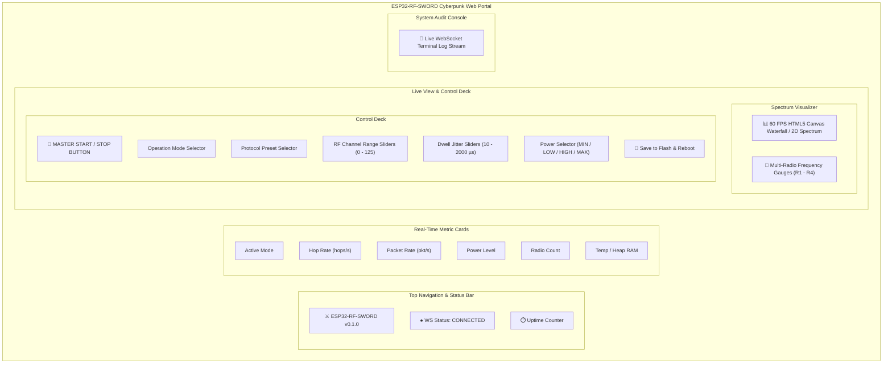
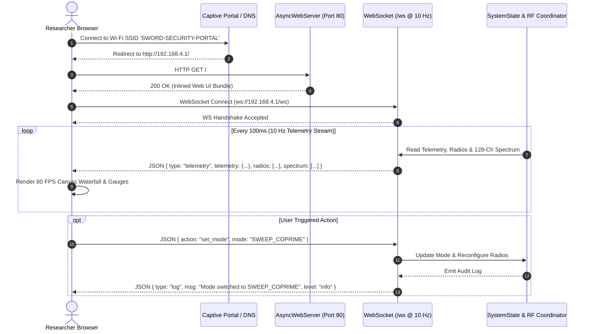

# Embedded Web Dashboard & API Guide

ESP32-RF-SWORD hosts a standalone, responsive cyber-themed Single Page Application directly from the ESP32's flash memory.

---

## Connecting to the Web Portal

1. **Connect to Wi-Fi**:
   - **SSID**: `SWORD-SECURITY-PORTAL`
   - **Password**: `rfsword123`
   - **Default IP**: `192.168.4.1`

2. **Captive Portal**:
   - When connecting on iOS, Android, macOS, or Windows, the captive portal prompt will automatically launch the dashboard.
   - Alternatively, navigate to `http://192.168.4.1` or `http://sword.local` in any modern web browser.

---

## Web Dashboard Architecture & Layout



---

## WebSocket Lifecycle & Communication Flow



---

## WebSocket Protocol Specification (`/ws`)

The WebSocket interface streams JSON telemetry frames at 10 Hz and receives real-time JSON command messages.

### Incoming Command Message Format:
```json
{
  "action": "set_mode",
  "mode": "SWEEP_COPRIME"
}
```

#### Available Actions:
- `toggle_run`: `{"action": "toggle_run", "run": true|false}`
- `set_mode`: `{"action": "set_mode", "mode": "<MODE_NAME>"}`
- `set_preset`: `{"action": "set_preset", "preset": "<PRESET_NAME>"}`
- `set_channels`: `{"action": "set_channels", "min": 2, "max": 80}`
- `set_dwell`: `{"action": "set_dwell", "min": 120, "max": 180}`
- `set_power`: `{"action": "set_power", "power": "MIN|LOW|HIGH|MAX"}`
- `save_config`: `{"action": "save_config"}`
- `reboot`: `{"action": "reboot"}`

### Outgoing Telemetry Message Format:
```json
{
  "type": "telemetry",
  "telemetry": {
    "uptime": 142,
    "freeHeap": 194560,
    "tempC": 42.5,
    "hopsPerSec": 6520,
    "packetsPerSec": 1240,
    "mode": "SWEEP_COPRIME",
    "preset": "Full Band 2.4GHz",
    "power": "MAX (0 dBm / +20dBm PA)",
    "radioCount": 2,
    "running": true
  },
  "radios": [
    {"present": true, "active": true, "channel": 42, "freq": 2442.0},
    {"present": true, "active": true, "channel": 81, "freq": 2481.0}
  ],
  "spectrum": [0, 0, 45, 80, 100, 20, 0, ...]
}
```
